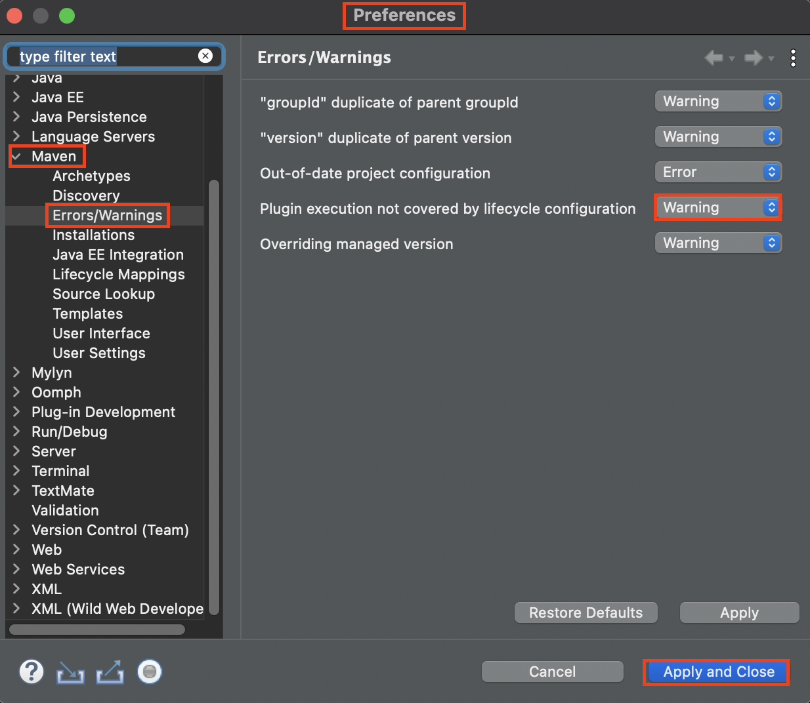
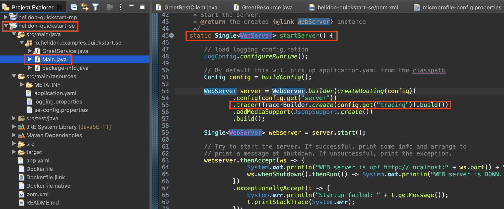
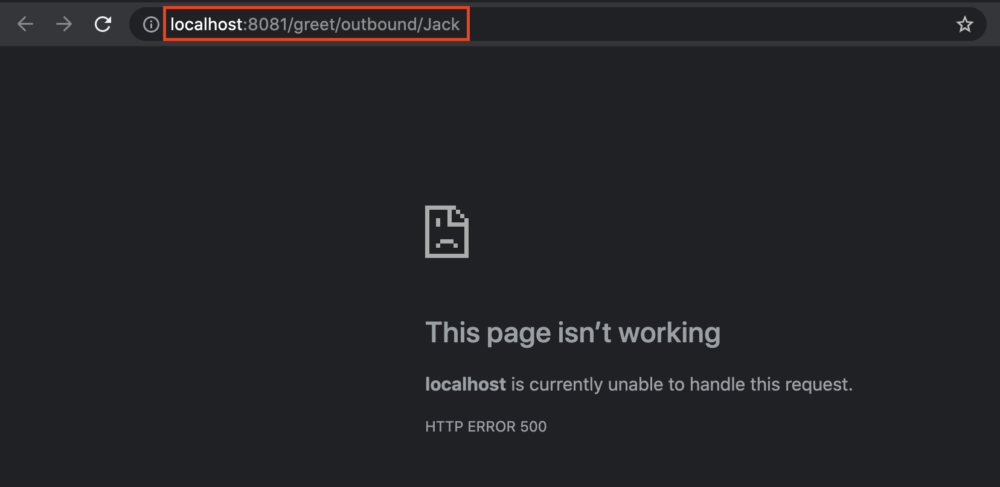
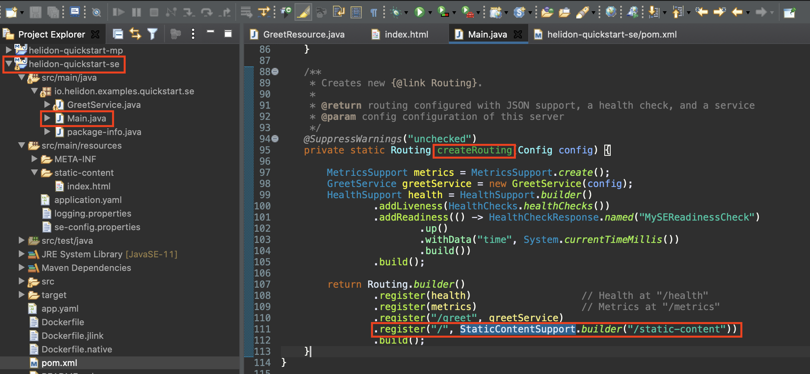

  
# Helidon tutorial

On this hands on lab you will learn how to write Java microservices application using [Helidon](https://helidon.io/#/). The framework supports two programming models for writing microservices: Helidon SE and Helidon MP. Helidon SE is designed to be a microframework that supports the reactive programming model, Helidon MP, on the other hand, is an Eclipse MicroProfile runtime that allows the Jakarta EE community to run microservices in a portable way. MicroProfile contains features like Metrics, Health Check, Streams Operators, Open Tracing, OpenAPI, REST client, and fault tolerance. You can find detailed information about MicroProfile on the [Eclipse MicroProfile](https://projects.eclipse.org/projects/technology.microprofile) site. In both cases, a Helidon microservice is a lightweight Java SE application with minimum dependency requirement, fast startup time and outstanding performance. The tutorial covers both programming models: Helidon SE reactive and Helidon MicroProfile (MP) APIs.

#### Prerequisites

- Java 11+
- Maven 3.6+
- Text editor or IDE to write and modify source code
- Basic Java software development knowledge

>This lab uses the Linux home folder `~` where the projects and sample files will be placed. In the tutorial you may see the home folder as`/home/luna.user` name instead of `~` because this tutorial is made and tested against on the luna.oracle.com demo environment.
If you use your own environment then replace the folder path to reflect your environment.

### Step 1. Create projects

Create workspace directory for Eclipse:
```bash
cd ~
mkdir workspace
```
Change the directory:
```bash
cd ~/workspace
```

#### Generate the *Helidon Quickstart SE* project
```bash
mvn -U archetype:generate -DinteractiveMode=false \
    -DarchetypeGroupId=io.helidon.archetypes \
    -DarchetypeArtifactId=helidon-quickstart-se \
    -DarchetypeVersion=2.3.0 \
    -DgroupId=io.helidon.examples \
    -DartifactId=helidon-quickstart-se \
    -Dpackage=io.helidon.examples.quickstart.se
```

#### Generate the *Helidon Quickstart MP* project
```bash
mvn -U archetype:generate -DinteractiveMode=false \
    -DarchetypeGroupId=io.helidon.archetypes \
    -DarchetypeArtifactId=helidon-quickstart-mp \
    -DarchetypeVersion=2.3.0 \
    -DgroupId=io.helidon.examples \
    -DartifactId=helidon-quickstart-mp \
    -Dpackage=io.helidon.examples.quickstart.mp
```

### Step 2: Sanity check

Check both projects:
```bash
cd ~/workspace/helidon-quickstart-se

mvn clean package

java -jar target/helidon-quickstart-se.jar
```
Try http://localhost:8080/greet in a browser or open new terminal (tab) and use `curl`:
```bash
curl http://localhost:8080/greet

{"message":"Hello World!"}
```

Stop the Java process (press *Ctrl+C* in the terminal where the application is running) and check MP version:
```bash
cd ~/workspace/helidon-quickstart-mp

mvn clean package

java -jar target/helidon-quickstart-mp.jar
```
Try http://localhost:8080/greet in a browser or open new terminal (tab) and use `curl`:
```bash
curl http://localhost:8080/greet

{"message":"Hello World!"}
```
Stop the Java process.

### Step 3: Import the projects into Eclipse

To build the applications you can use your favourite IDE or text editor. In this tutorial we use the widely adopted Eclipse. The import process is the following:

Launch Eclipse  and during the startup define your workspace folder: `/home/luna.user/workspace` and click **Launch**.


Close the *Welcome* window if you have and select **File->Import** menu item. In the import wizard dialog select **Maven->Existing Maven Projects** and click **Next**.

<p align="center">

</p>

Select `/home/luna.user/workspace/helidon-quickstart-se` and click **Finish**.

<p align="center">

</p>

Repeat the import steps for the MP project using the `/home/luna.user/workspace/helidon-quickstart-mp` folder.

> ##### Resolve helidon-quickstart-mp Jandex/Maven issue
> If Eclipse shows error for *helidon-quickstart-mp* project then Click **Finish** and **OK** to skip warning.
> To resolve the issue open **Window->Preferences** and click **Maven->Errors/Warnings** and change notifications from *Error* to *Warning* when *Plugin execution not covered by lifecycle configuration*
> <p align="center">

</p>
> Click **Apply and Close** and click **OK** to update the project.

Now the applications are imported and ready to develop.

<p align="center">

</p>

During the steps the Microprofile style `helidon-quickstart-mp` project hereafter referred to as *MP project* while the SE style `helidon-quickstart-se` project hereafter referred to as *SE project*.

After the import using Eclipse you can take a look on the `Main.java` in SE project. SE is the *core* version of Helidon that requires almost everything to be done manually. However Helidon SE is more smaller and faster comparing not just to MP but to other microservices frameworks.

On the other you can't see `Main.class` or starter class in the MP project. Technically, your own main class is not needed unless you want to control the startup sequence. In the next chapter you will create this `Main.class` to change default configuration source and order.

But in case of SE the `Main.class` is there and already contains several configuration elements to activate built in features and the custom logic.


However to start a simple server using `Config` is not a big deal, but comparing to MP requires few more lines.

The other main difference is the implementation of the *Greet* service endpoint. In case of MP it is a well known JAX-RS using annotations (see `GreetResource.java`). Simple coding and the framework does the rest of the job. While SE requires `Routing` definition where the service (see `GreetService.java`) which takes care about the response is registered. Functional, controlled, lightweight and streamlined API usage.

### Step 4: Using Config

The config component provides a Java API to load and process configuration properties from various sources into a Config object which the application can use to retrieve config data.

The system reads configuration from a *config source*, a physical location (such as a file, a URL, or a `String`) which holds config data. Each config source works with a *config parser* which translates a particular text format (for example, Java properties or YAML) into an in-memory tree which represents the configuration’s structure and values. An optional *polling strategy* detects and publishes changes to the underlying config source so the config source itself or your application can respond.

Your application uses the `Config` object which results from building that in-memory tree to retrieve config data. The app can navigate explicitly among the nodes in the tree and fetch a node’s value. The `Config` object lets your application retrieve config data as a typed ConfigValue.

The default config uses the following config sources:

1. System properties config source
2. Environment variables config source
3. A classpath config source called `application.?` where the `?` depends on supported media types currently on the classpath. By default it is `properties`, if you have YAML support on classpath, it would be `application.yaml` (a `ConfigParser` may add additional supported suffixes for default file)

The priority (most to least important) means that if a given config key appears in more than one source, the value assigned in a more important source overrules the value from a less important source.

The MP and SE sample projects have default config files. Open and modify the port number for MP projects. The `microprofile-config.properties` file is located under the `src/main/resources/META-INF` folder. Open them in Eclipse and check their content.

Modify configuration of MP project to run on a different port. Replace the 8080 value to 8081:

```java
# Microprofile server properties
server.port=8081
server.host=0.0.0.0
```


Save the config file. To run the MP application from Eclipse and adding custom server start and/or configuration we need to implement `Main.class` or starter class.
Create `Main.class` in the `io.helidon.examples.quickstart.mp` package. Right click on the package name and select **New -> Class**:


Create the class with the default recommendations and replace the content with the following code:
```java
package io.helidon.examples.quickstart.mp;

import io.helidon.microprofile.server.Server;
import java.io.IOException;

public final class Main {

    private Main() { }

    public static void main(final String[] args) throws IOException {
        Server server = startServer();
        System.out.println("http://localhost:" + server.port() + "/greet");
    }

    static Server startServer() {
        return Server.builder()
            .build()
            .start();
    }
}
```

Now Eclipse can simply start the application using the `Main.class`. (Right click on `Main.java` and select **Run->Java Application**)


Check the result in browser: [http://localhost:8081/greet](http://localhost:8081/greet)

### Step 5: Configuration sources, change support

After using the default config file now customise the configuration on both projects.

First for MP project create the `mp-config.yaml` config file in the resources folder. Right click on `src/main/resources` and select **New->Other...**


Select **General->File** and click **Next**.
<p align="center">

</p>

Type `mp-config.yaml` as name.
  <p align="center">
  
  </p>

Copy the following content into the new file and save.
```yaml
app:
 greeting: "Hello Helidon MP from YAML config"
```

In the MP project open the `io.helidon.examples.conference.mp.Main` class and add a new `buildConfig` method which reads the new config file.
```java
private static Config buildConfig() {
    return Config.builder()
        .disableEnvironmentVariablesSource()
        .sources(
            classpath("mp-config.yaml").optional(),
            classpath("META-INF/microprofile-config.properties"))
        .build();
}
```
Change server startup to:
```java
    return Server.builder()
        .config(buildConfig())
        .build()
        .start();
```
If the IDE can't offer the missing import packages then copy from here:
```java
import io.helidon.config.Config;
import static io.helidon.config.ConfigSources.classpath;
```

The `Main.java` should be similar:


Run the MP application using `Main.java` and check the result at: [http://localhost:8081/greet](http://localhost:8081/greet)
<p align="center">

</p>

Now modify the SE application, but here register polling to watch config file changes. Due to the polling the application will pick up the configuration changes in the file without the application restart. However this requires external configuration file.

Create the `se-config.properties` config file in the SE project `resources` folder. In the SE project right click on `src/main/resources` and select **New->Other...** than select **General->File** and click **Next**. Type `mp-config.yaml` as name.

Copy the following content and save:
```bash
app.greeting=Hello Helidon SE
```
In the SE project open the `io.helidon.examples.conference.se.Main` class and add a new `buildConfig` method which reads the new config file and register the polling. If you have different file location then don't forget to modify the path in the snippet below.

```java
private static Config buildConfig() {

    return Config
            .builder()
            // specify config sources
            .sources(file("/home/luna.user/workspace/helidon-quickstart-se/src/main/resources/se-config.properties")
                .pollingStrategy(regular(Duration.ofSeconds(1))),
                     classpath("application.yaml"))
            .build();
}
```
If the IDE can't offer the missing import packages then copy from here:
```java
import static io.helidon.config.ConfigSources.file;
import static io.helidon.config.ConfigSources.classpath;
import static io.helidon.config.PollingStrategies.regular;

import java.time.Duration;
```
Find the default config creation in the `startServer` method:
```java
Config config = Config.create();
```
and replace to the new `buildConfig` method:
```java
Config config = buildConfig();
```
The `Main.java` should look like similar:


To reflect the runtime config changes modify the `io.helidon.examples.quickstart.se.GreetService` class.
Open the class and instead of the `private final AtomicReference<String> greeting = new AtomicReference<>();` add a new member to store the value:
```java
private Supplier<String> greetingSupplier;
```
Modify the constructor `GreetService` method to set supplier instead of the `greeting` member.
```java
greetingSupplier = config.get("app.greeting").asString().supplier("Ciao");
```
Use the supplier in the `sendResponse` method (replace the line where is the error):
```java
String msg = String.format("%s %s!", greetingSupplier.get(), name);
```
Finally in the `updateGreetingFromJson` method use the supplier instead of the old `greeting` variable (replace the line where is the error).
```java
greetingSupplier = () -> jo.getString("greeting");
```
Check your `GreetService` class:


Run the SE application using `Main.java` and check the result at: [http://localhost:8080/greet](http://localhost:8080/greet) or using `curl` from Terminal window.
```bash
curl http://localhost:8080/greet
{"message":"Hello Helidon SE from YAML config World!"}
```
Now change the `se-config.properties` config file *greeting* property:
```bash
app.greeting=Hello Helidon SE from YAML config 2
```
Save the changes and check again the response of the application. Shortly you have to see the new result:
```bash
curl http://localhost:8080/greet
{"message":"Hello Helidon SE from YAML config 2 World!"}
```

### Step 6: Metrics

Helidon provides the following to support metrics:

1. The endpoint `/metrics`: A configurable endpoint that exposes metrics information in JSON format (as specified by the MicroProfile Metrics specification) or in plain text (for Prometheus metrics).
Check the plain text using browser: http://localhost:8081/metrics
```
# TYPE base_REST_request_total counter
# HELP base_REST_request_total The number of invocations and total response time of RESTful resource methods since the start of the server.
base_REST_request_total{class="io.helidon.examples.quickstart.mp.GreetResource",method="getDefaultMessage"} 1
# TYPE base_REST_request_elapsedTime_seconds gauge
base_REST_request_elapsedTime_seconds{class="io.helidon.examples.quickstart.mp.GreetResource",method="getDefaultMessage"} 0.004993732
base_REST_request_total{class="io.helidon.examples.quickstart.mp.GreetResource",method="getMessage_java.lang.String"} 0
base_REST_request_elapsedTime_seconds{class="io.helidon.examples.quickstart.mp.GreetResource",method="getMessage_java.lang.String"} 0.0
base_REST_request_total{class="io.helidon.examples.quickstart.mp.GreetResource",method="updateGreeting_javax.json.JsonObject"} 0
base_REST_request_elapsedTime_seconds{class="io.helidon.examples.quickstart.mp.GreetResource",method="updateGreeting_javax.json.JsonObject"} 0.0
# TYPE base_classloader_loadedClasses_count gauge
# HELP base_classloader_loadedClasses_count Displays the number of classes that are currently loaded in the Java virtual machine.
base_classloader_loadedClasses_count 8873
# TYPE base_classloader_loadedClasses_total counter
# HELP base_classloader_loadedClasses_total Displays the total number of classes that have been loaded since the Java virtual machine has started execution.
base_classloader_loadedClasses_total 8873
# TYPE base_classloader_unloadedClasses_total counter
# HELP base_classloader_unloadedClasses_total Displays the total number of classes unloaded since the Java virtual machine has started execution.
base_classloader_unloadedClasses_total 0
# TYPE base_cpu_availableProcessors gauge
# HELP base_cpu_availableProcessors Displays the number of processors available to the Java virtual machine. This value may change during a particular invocation of the virtual machine.
base_cpu_availableProcessors 4
# TYPE base_cpu_systemLoadAverage gauge
# HELP base_cpu_systemLoadAverage Displays the system load average for the last minute. The system load average is the sum of the number of runnable entities queued to the available processors and the number of runnable entities running on the available processors averaged over a period of time. The way in which the load average is calculated is operating system specific but is typically a damped timedependent average. If the load average is not available, a negative value is displayed. This attribute is designed to provide a hint about the system load and may be queried frequently. The load average may be unavailable on some platforms where it is expensive to implement this method.
base_cpu_systemLoadAverage 3.04638671875
# TYPE base_gc_time_seconds gauge
# HELP base_gc_time_seconds Displays the approximate accumulated collection elapsed time in milliseconds. This attribute displays -1 if the collection elapsed time is undefined for this collector. The Java virtual machine implementation may use a high resolution timer to measure the elapsed time. This attribute may display the same value even if the collection count has been incremented if the collection elapsed time is very short.
base_gc_time_seconds{name="G1 Old Generation"} 0.0
base_gc_time_seconds{name="G1 Young Generation"} 0.06
# TYPE base_gc_total counter
# HELP base_gc_total Displays the total number of collections that have occurred. This attribute lists -1 if the collection count is undefined for this collector.
base_gc_total{name="G1 Old Generation"} 0
base_gc_total{name="G1 Young Generation"} 7
# TYPE base_jvm_uptime_seconds gauge
# HELP base_jvm_uptime_seconds Displays the start time of the Java virtual machine in milliseconds. This attribute displays the approximate time when the Java virtual machine started.
base_jvm_uptime_seconds 19847.099
# TYPE base_memory_committedHeap_bytes gauge
# HELP base_memory_committedHeap_bytes Displays the amount of memory in bytes that is committed for the Java virtual machine to use. This amount of memory is guaranteed for the Java virtual machine to use.
base_memory_committedHeap_bytes 325058560
# TYPE base_memory_maxHeap_bytes gauge
# HELP base_memory_maxHeap_bytes Displays the maximum amount of heap memory in bytes that can be used for memory management. This attribute displays -1 if the maximum heap memory size is undefined. This amount of memory is not guaranteed to be available for memory management if it is greater than the amount of committed memory. The Java virtual machine may fail to allocate memory even if the amount of used memory does not exceed this maximum size.
base_memory_maxHeap_bytes 4294967296
# TYPE base_memory_usedHeap_bytes gauge
# HELP base_memory_usedHeap_bytes Displays the amount of used heap memory in bytes.
base_memory_usedHeap_bytes 50400208
# TYPE base_thread_count gauge
# HELP base_thread_count Displays the current number of live threads including both daemon and nondaemon threads
base_thread_count 31
# TYPE base_thread_daemon_count gauge
# HELP base_thread_daemon_count Displays the current number of live daemon threads.
base_thread_daemon_count 25
# TYPE base_thread_max_count gauge
# HELP base_thread_max_count Displays the peak live thread count since the Java virtual machine started or peak was reset. This includes daemon and non-daemon threads.
base_thread_max_count 31
# TYPE vendor_requests_count_total counter
# HELP vendor_requests_count_total Each request (regardless of HTTP method) will increase this counter
vendor_requests_count_total 5
# TYPE vendor_requests_meter_total counter
# HELP vendor_requests_meter_total Each request will mark the meter to see overall throughput
vendor_requests_meter_total 5
# TYPE vendor_requests_meter_rate_per_second gauge
vendor_requests_meter_rate_per_second 2.519667012244372E-4
# TYPE vendor_requests_meter_one_min_rate_per_second gauge
vendor_requests_meter_one_min_rate_per_second 0.011458136074669095
# TYPE vendor_requests_meter_five_min_rate_per_second gauge
vendor_requests_meter_five_min_rate_per_second 0.0030925140804588976
# TYPE vendor_requests_meter_fifteen_min_rate_per_second gauge
vendor_requests_meter_fifteen_min_rate_per_second 0.0010836791284289167
```
For JSON result use `curl`:
```bash
curl -s -H 'Accept: application/json' -X GET http://localhost:8081/metrics/
{
   "vendor" : {
      "requests.count" : 2,
      "requests.meter" : {
         "count" : 2,
         "oneMinRate" : 0.184008882925865,
         "fiveMinRate" : 0.196694290764323,
         "meanRate" : 0.137409268792931,
         "fifteenMinRate" : 0.198891969600979
      }
   },
   "base" : {
      "thread.daemon.count" : 17,
      "classloader.currentLoadedClass.count" : 6674,
      "thread.count" : 21,
      "cpu.availableProcessors" : 4,
      "gc.PS Scavenge.count" : 3,
      "gc.PS Scavenge.time" : 25,
      "memory.maxHeap" : 3817865216,
      "cpu.systemLoadAverage" : 2.11376953125,
      "classloader.totalLoadedClass.count" : 6667,
      "memory.committedHeap" : 199229440,
      "gc.PS MarkSweep.time" : 39,
      "memory.usedHeap" : 75511008,
      "thread.max.count" : 22,
      "jvm.uptime" : 16719,
      "gc.PS MarkSweep.count" : 1,
      "classloader.totalUnloadedClass.count" : 2
   }
}
```
2. A base set of metrics, available at `/metrics/base`, as specified by the MicroProfile Metrics specification.
3. A set of Helidon-specific metrics, available at `/metrics/vendor`
Check the plain text result using browser: http://localhost:8081/metrics/vendor

#### Add custom metrics

In case of MP it is basically just an annotation. Add the following annotation to the `getDefaultMessage` method in the  `io.helidon.examples.quickstart.mp.GreetResource` class.

```java
@Timed
@Counted(name = "my-mp-metrics", absolute = true)
```


Save the changes, stop the running application if necessary and run again `Main.java` in MP project.

Check the result at: http://localhost:8081/metrics/application/my-mp-metrics
Refresh few times the http://localhost:8081/greet page and check again the counter:
```bash
# TYPE application_my_mp_metrics_total counter
# HELP application_my_mp_metrics_total
application_my_mp_metrics_total 1
```

Another metric types also available for Prometheus about the configured method. You can check at http://localhost:8081/metrics/application/io.helidon.examples.quickstart.mp.GreetResource.getDefaultMessage. These are history/summary and gauge type metrics.

In SE project we need more coding. Remember, no magic here : )

Add metric support to `GreetService.java` in the constructor. Also create `defaultMessageCounter` member to store the actual value:
```java
private final Counter defaultMessageCounter;

GreetService(Config config) {
  greetingSupplier = config.get("app.greeting").asString().supplier("Ciao");
  RegistryFactory metricsRegistry = RegistryFactory.getInstance();
  MetricRegistry appRegistry = metricsRegistry.getRegistry(MetricRegistry.Type.APPLICATION);
  defaultMessageCounter = appRegistry.counter("my-se-metrics");
}
 ```
Increment the counter value when `getDefaultMessageHandler` is called:
```java
private void getDefaultMessageHandler(ServerRequest request,
                               ServerResponse response) {
    defaultMessageCounter.inc();
    sendResponse(response, "World");
}
```

Save the changes. Stop the SE application if necessary and run again using `Main.java` in SE project.

After hitting few times the http://localhost:8080/greet/ check the metrics at http://localhost:8080/metrics/application/my-se-metrics:
```bash
# TYPE application_my_se_metrics_total counter
# HELP application_my_se_metrics_total
application_my_se_metrics_total 3
```
#### Use Prometheus to monitor metrics

Prometheus is an open-source systems monitoring and alerting toolkit. Prometheus joined the Cloud Native Computing Foundation in 2016 as the second hosted project, after Kubernetes. Its main feature is the multi-dimensional data model with time series data identified by metric name and key/value pairs.

Prometheus is a Java based application what you need to download, configure and run to collect metrics from application like Helidon.

Run the script below which does all the necessary step fopr you. (It requires Java.):

```bash
curl -LSs https://raw.githubusercontent.com/nagypeter/helidon-tutorial/master/scripts/setup.prometheus.sh | bash
```

When the script completes you can see the log entries of Prometheus. Open http://localhost:9090/ and select your custom metrics produced by Helidon.
Start typing "my" in expression field and list appears with recommendations. Select e.g. *application_my_mp_metrics_total* and click **Execute** to add this metrics to the panel. You can see the current value but you can also change to graph view. To increase the value hit the http://localhost:8081/greet few times. You can play and check with other metrics.


### Step 7: Health checks

It’s a good practice to monitor your microservice’s health, to ensure that it is available and performs correctly.

Applications implement health checks to expose health status that is collected at regular intervals by external tooling, such as orchestrators like Kubernetes. The orchestrator may then take action, such as restarting your application if the health check fails.

A typical health check combines the statuses of all the dependencies that affect availability and the ability to perform correctly:

- network latency
- storage
- database
- other services used by your application

#### MP Health checks

Helidon MP implements the MicroProfile Health spec. The spec prescribes how external tools probe a service’s health checks and how you implement health checks as part of your microservice that are specific to your service’s needs.

Helidon provides built-in, default checks for each endpoint. The built-in liveness checks include various environmental values, such as whether the JVM has detected deadlocks or whether there is sufficient heap space. The built-in readiness check always reports `UP`. Check built-in health status at http://localhost:8081/health.
The result should have similar:
```bash
{
   "outcome": "UP",
   "status": "UP",
   "checks" : [
      {
         "name" : "deadlock",
         "state" : "UP",
         "status": "UP"
      },
      {
        "name": "diskSpace",
        "state": "UP",
        "status": "UP",
         "data" : {
            "freeBytes" : 206935879680,
            "totalBytes" : 499963174912,
            "percentFree" : "41.39%",
            "total" : "465.63 GB",
            "free" : "192.72 GB"
         }
      },
      {
        "name": "heapMemory",
        "state": "UP",
        "status": "UP",
         "data" : {
            "freeBytes" : 214995600,
            "totalBytes" : 240648192,
            "total" : "229.50 MB",
            "free" : "205.04 MB",
            "max" : "3.56 GB",
            "percentFree" : "99.33%",
            "maxBytes" : 3817865216
         }
      }
   ]
}
```

MicroProfile Health supports two types of health checks:
- **Liveness** checks report whether the runtime environment in which the service is running is sufficient to support the work the service performs. The environment is beyond the control of the service itself and typically cannot improve without outside intervention. If a microservice instance reports a `DOWN` liveness check, it should never report `UP` later. It will need to be stopped and a replacement instance created.
- **Readiness** checks report whether the service is currently capable of performing its work. A service that reports `DOWN` for its readiness cannot at the moment do its job, but at some future point it might become able to do so without requiring a restart.

##### MP Liveness Health Check

To add custom liveness health check create a new class called `GreetLivenessCheck` in `io.helidon.examples.quickstart.mp` package.
(To create new class right click on the `io.helidon.examples.quickstart.mp` package under the *helidon-quickstart-mp* project in the left Project Explorer area and select **New->Class** menu item. Type the class name: `GreetLivenessCheck` and click **OK**.) Copy the the content below into the new class.
```java
package io.helidon.examples.quickstart.mp;

import javax.enterprise.context.ApplicationScoped;
import org.eclipse.microprofile.health.HealthCheck;
import org.eclipse.microprofile.health.HealthCheckResponse;
import org.eclipse.microprofile.health.Liveness;

@Liveness
@ApplicationScoped
public class GreetLivenessCheck implements HealthCheck {

	@Override
	public HealthCheckResponse call() {
		return HealthCheckResponse.named("MyMPLivenessCheck").up().withData("time", System.currentTimeMillis()).build();
	}
}
```


Of course this check doesn't do a real check just demonstrates the place and method for such custom action. It only shows the current time and return `UP` status always.
Save the changes. Stop the MP application if necessary and run again. Check the health information again using the browser: http://localhost:8081/health/ and find the your custom (MyMPLivenessCheck) health data in the response:
```bash
{
  "name": "MyMPLivenessCheck",
  "state": "UP",
  "status": "UP",
  "data": {
    "time": 1624090912474
  }
},
```

##### MP Readiness Health Check

To add custom readiness health check create a new class called `GreetReadinessCheck` in `io.helidon.examples.quickstart.mp` package.
(To create new class right click on the `io.helidon.examples.quickstart.mp` package under the *helidon-quickstart-mp* project in the left Project Explorer area and select **New->Class** menu item. Type the class name: `GreetReadinessCheck` and click **OK**.) Copy the the content below into the new class.
```java
package io.helidon.examples.quickstart.mp;

import java.time.Duration;
import java.util.concurrent.atomic.AtomicLong;
import javax.enterprise.context.ApplicationScoped;

import javax.enterprise.context.Initialized;
import javax.enterprise.event.Observes;
import org.eclipse.microprofile.health.HealthCheck;
import org.eclipse.microprofile.health.HealthCheckResponse;
import org.eclipse.microprofile.health.Readiness;

@Readiness
@ApplicationScoped
public class GreetReadinessCheck implements HealthCheck {
  private AtomicLong readyTime = new AtomicLong(0);


  @Override
  public HealthCheckResponse call() {
    return HealthCheckResponse.named("MyMPReadinessCheck")  
        .state(isReady())
        .withData("time", readyTime.get())
        .build();
  }

  public void onStartUp(
      @Observes @Initialized(ApplicationScoped.class) Object init) {
    readyTime = new AtomicLong(System.currentTimeMillis());
  }

  /**
   * Become ready after 10 seconds
   *
   * @return true if application ready
   */
  private boolean isReady() {
    return Duration.ofMillis(System.currentTimeMillis() - readyTime.get()).getSeconds() >= 10;
  }
}
```


This check also doesn't do any check but what is important here application needs time to start properly. To demonstrate this delay the `isReady` method return true after 10 seconds of the application start. Before you restart the application make your browser (http://localhost:8081/health) ready to see the different states of the `MyMPReadinessCheck`.

```bash
{
  "name": "MyMPReadinessCheck",
  "state": "UP",
  "status": "UP",
  "data": {
    "time": 1624093400263
  }
},
```

#### SE Health checks

Actually in case of SE is still easy to add customer health check. Instead of annotation you need to add your custom health check when you build and register the `HealthSupport`. To make it simpler the check is implemented in place without introducing a new class. This check will always  return `UP` state and current time in millisecond as value. The SE quickstart project already configured to produce built-in health check, thus you need to just add additional custom check.
Modify `HealthSupport` build in the SE project's `Main.class`. This part can be found in the `createRouting` method:
```java
.addReadiness(() -> HealthCheckResponse.named("MySEReadinessCheck")
        .up()
        .withData("time", System.currentTimeMillis())
        .build())
```
The complete `HealthSupport` build part should look like this:
```java
HealthSupport health = HealthSupport.builder()
        .addLiveness(HealthChecks.healthChecks())
        .addReadiness(() -> HealthCheckResponse.named("MySEReadinessCheck")
                .up()
                .withData("time", System.currentTimeMillis())
                .build())
        .build();
```


Save the changes. Stop the SE application (if necessary) and run again using `Main.java`.

Check that the health information contains the new custome check:
```bash
{
  "name": "MySEReadinessCheck",
  "state": "UP",
  "status": "UP",
  "data": {
    "time": 1624093811991
  }
},
```

### Step 8: Connect the services

In this example MP application will call the SE application's service. This communication is very common in microservices architecture. MicroProfile Rest Client adds the capability to invoke remote microservices using a JAX-RS like interface to declare the operations.

Since you are dealing with remote object first you need to create a rest client interface. A rest client interface can be annotated with `@RegisterRestClient` to automatically register it with CDI. The `RegisterRestClient` annotation has a property `baseUri` that can be used to define the base endpoint of this client. In the interface you need to only define the necessary endpoints which is now the `/greet/{name}`.
To create new interface right click on the `io.helidon.examples.quickstart.mp` package under the *helidon-quickstart-mp* project in the left Project Explorer area and select **New->Interface** menu item. Type the interface name: `GreetRestClient` and click **OK**. Please pay attention, now you need to create **interface** and not **class**!
Copy the following source in the new interface.

```java
package io.helidon.examples.quickstart.mp;

import javax.json.JsonObject;
import javax.ws.rs.GET;
import javax.ws.rs.Path;
import javax.ws.rs.PathParam;

import org.eclipse.microprofile.rest.client.inject.RegisterRestClient;

@RegisterRestClient(baseUri="http://localhost:8080/greet")
interface GreetRestClient {

     @GET
     JsonObject getDefaultMessage();

     @Path("/{name}")
     @GET
     JsonObject getMessage(@PathParam("name") String name);

}
```
By calling `GreetRestClient.getMessage()` you reach the endpoint of the SE application.


Once a rest client interface is annotated, it can be injected into any CDI bean. Open `GreetResource.java` and add the following part example after the last method:
```java
@Inject
@RestClient
GreetRestClient restClient;

@GET
@Path("/outbound/{name}")
public JsonObject outbound(@PathParam("name") String name) {
   return restClient.getMessage(name);
}
```
This part injects the interface and define `/outbound/{name}` endpoint for MP application to invoke the REST call to the SE application.
Usually the member declaration happens before the method(s) declaration but for easier understanding just copy together after the last method.

Save the changes, restart the MP application and test the outbound call: http://localhost:8081/greet/outbound/Jack:
```bash
{"message":"Hello Helidon SE from YAML config 2 Jack!"}
```
You have to see the SE application's message including the name appended to the outbound path as parameter.

### Step 9: Tracing

Helidon includes support for tracing through the OpenTracing APIs. Tracing is integrated with WebServer and Security. Helidon has further integration with Zipkin and Jaeger tracer tools. This lab demonstrates Zipkin usage.

#### Activate Tracing in SE Application

To activate tracing in SE application first add necessary libraries (dependencies) to the Maven project, `pom.xml`. Find the `<dependencies>` list and insert the following elements:
```xml
<dependency>
  <groupId>io.helidon.tracing</groupId>
  <artifactId>helidon-tracing</artifactId>
</dependency>
<dependency>
  <groupId>io.helidon.tracing</groupId>
  <artifactId>helidon-tracing-zipkin</artifactId>
</dependency>
```

Save the `pom.xml`.

In quickstart project the tracer is not registered in the webserver. To do so open the `Main.java` and find `startServer` method and add the following line in the builder part:
```java
.tracer(TracerBuilder.create(config.get("tracing")).build())
```
The webserver creation should look like the following:
```java
WebServer server = WebServer.builder(createRouting(config))
        .config(config.get("server"))
        .tracer(TracerBuilder.create(config.get("tracing")).build())
        .addMediaSupport(JsonpSupport.create())
        .build();
```

Save the `Main.java` class.

Finally open the `application.yaml` configuration file and add tracing configuration element. It is enough to just set a name for the tracing service what will be displayed for this application in Zipkin. The other parameters can be default.
```yaml
tracing:
  service: helidon-se
```
<p align="center">

</p>
Save the `application.yaml` and restart the SE application.

#### Activate Tracing in MP Application

To switch on the tracing in MP application add only the Zipkin tracing dependency to the MP application's `pom.xml`:

```xml
<dependency>
    <groupId>io.helidon.tracing</groupId>
    <artifactId>helidon-tracing-zipkin</artifactId>
</dependency>
```

Save the changes.

Configure the service name here too in the `microprofile-config.properties` property file which is located under `src/main/resources/META-INF` folder. Add the following property:
```java
tracing.service=helidon-mp
```

Save changes and restart the MP application.

#### Start Zipkin and monitor applications

To start Zipkin tracer without docker installed run the following script:
```bash
curl -LSs https://raw.githubusercontent.com/nagypeter/helidon-tutorial/master/scripts/setup.zipkin.sh | bash
```
This will start the Zipkin tracer on `http://localhost:9411` - this is
also the default configuration that Helidon expects.

You can open the dashboard on http://localhost:9411/zipkin/

Now to generate tracing information invoke again the outbound call using the browser http://localhost:8081/greet/outbound/Bill:
```bash
{"message": "Hello Helidon SE from YAML config 2 Bill!"}
```
Now open Zipkin to see the tracing information: http://localhost:9411/zipkin/ and on the (default) *Find a trace* page click the **Run Query** button. If you have multiple results click **Expand All** to find easily that which has multiple components in the transaction. Then open the details with **Show** button.  


There you can see the detailed tracing result where both services are involved.


### Step 10: Fault Tolerance

Shutdown the SE service.

Try invoking the `/greet/outbound` endpoint: http://localhost:8081/greet/outbound/Jack. You should get an internal server (HTTP ERROR 500) error.



To avoid such failure a microservices application always needs to prepared for such situation like service restarts, network delays, temporal infrastructure instabilities, etc. Fault Tolerance is a MicroProfile specification which improves application robustness by providing support to conveniently handle error conditions (faults) that may occur in real-world applications.

Add annotation to the method `outbound` in `GreetResource.java` in the MP project:
```java
@Fallback(fallbackMethod = "onFailureOutbound")
```

And create the fallback method:
```java
public JsonObject onFailureOutbound(String name) {
    return Json.createObjectBuilder().add("Failed", name).build();
}
```


Save changes restart both, MP and SE applications and validate that works as expected: http://localhost:8081/greet/outbound/Jack

Shutdown the SE application.

Try again the `/greet/outbound` endpoint: http://localhost:8081/greet/outbound/Jack. Now you should see
 the **Failed** message instead of an internal server error.

<p align="center">

</p>

If you have time you can check the failure when SE invocation is not happening or previous HTTP ERROR 500 in the Zipkin: http://localhost:9411/zipkin/


### Step 11: Static content

Helidon application can serve static content for example web page.
So let's create a simple HTML page which invokes the `/greet` service and print the result.

First add

To activate static content support first add the necessary dependency to the Maven project, `pom.xml`:
```xml
  <dependency>
	    <groupId>io.helidon.webserver</groupId>
	    <artifactId>helidon-webserver-static-content</artifactId>
	</dependency>
```

Save the `pom.xml`.

Create a `static-content` folder in the SE project under the `resources` folder. Right click on the `resources` folder and select **New... -> Other.. -> General -> Folder**. Create a new html file called `index.html` and copy the content below into the new file. (Use right click on `static-content` folder and select **New... -> Other.. -> Web -> HTML File**)
```html
<!DOCTYPE html>
<html>
<head>
<meta charset="UTF-8">
<title>Helidon SE</title>
</head>
<body>
	<h2>Invoke greet:</h2>
	<div id="greetMessage"></div>

	<script>
		var xmlhttp = new XMLHttpRequest();
		var url = "/greet";

		xmlhttp.onreadystatechange = function() {
			if (this.readyState == 4 && this.status == 200) {
				document.getElementById("greetMessage").innerHTML = this.responseText;
			}
		};
		xmlhttp.open("GET", url, true);
		xmlhttp.send();
	</script>
</body>
</html>
```


Register the static content folder in the router. Add the following line to router builder in the `createRouting` method in the `Main.java`:
```java
.register("/", StaticContentSupport.builder("/static-content"))
```
Please pay attention to import the right `StaticContentSupport` class:
```java
import io.helidon.webserver.staticcontent.StaticContentSupport;
```



Save the changes and restart the SE application. Open http://localhost:8080/index.html in a browser. The html page invokes the `/greet` endpoint and prints the result.
<p align="center">

</p>

After the application test stop all your running Helidon applications.

Congratulate you completed Helidon SE and MP basics lab!
