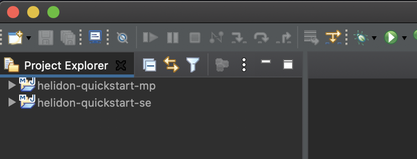

# Helidon tutorial

On this hands on lab you will learn how to write Java microservices application using [Helidon](https://helidon.io/#/). The tutorial covers both programming models: Helidon SE reactive and Helidon MicroProfile (MP) APIs.

#### Prerequisites

- Java 8+
- Maven 3.5+
- Docker
- Text editor or IDE to write and modify source code

Alternative option: [download](https://drive.google.com/open?id=11CvOZ-j50-2q9-rrQmxpEwmQZbPMkw2a) and import the preconfigured VirtualBox image (total required space > 12 GB).
[Download VirtualBox](https://www.virtualbox.org/wiki/Downloads) if necessary.

---
NOTE, if you use VirtualBox environment!
Before you start update HOL desktop environment (VirtualBox image) and install Eclipse.

Depending on your network connection make sure you switched ON or OFF the proxy configuration by clicking the corresponding shortcut on the desktop.

After the proxy configuration double click the **Update** icon and wait until the update process complete. Hit enter when you see the Press [Enter] to close the window message to close the update terminal.


To install Eclipse open terminal window and execute the following script:
```bash
/u01/content/vmcontrol/control/bin/installEclipse.sh
```
When the script completes you will see a new *Eclipse* icon on the desktop.


>This lab assumes that there is folder `/u01` where the projects and sample files will be placed. If you use your own environment then replace the folder path to reflect your environment.

### Step 1. Create projects

Create workspace directory for Eclipse:
```bash
mkdir -p /u01/workspace
```
Change the directory:
```bash
cd /u01/workspace
```

#### Generate the *Conference SE* project
```bash
mvn archetype:generate -DinteractiveMode=false \
    -DarchetypeGroupId=io.helidon.archetypes \
    -DarchetypeArtifactId=helidon-quickstart-se \
    -DarchetypeVersion=1.0.0 \
    -DgroupId=io.helidon.examples \
    -DartifactId=conference-se \
    -Dpackage=io.helidon.examples.conference.se
```

#### Generate the *Conference MP* project
```bash
mvn archetype:generate -DinteractiveMode=false \
    -DarchetypeGroupId=io.helidon.archetypes \
    -DarchetypeArtifactId=helidon-quickstart-mp \
    -DarchetypeVersion=1.0.0 \
    -DgroupId=io.helidon.examples \
    -DartifactId=conference-mp \
    -Dpackage=io.helidon.examples.conference.mp
```

### Step 2: Sanity check

Check both projects:
```bash
cd /u01/workspace/conference-se

mvn clean package

java -jar target/conference-se.jar
```
Try http://localhost:8080/greet in a browser or open new terminal (tab) and use `curl`:
```bash
curl http://localhost:8080/greet

{"message":"Hello World!"}
```

Stop the Java process and check MP version:
```bash
cd /u01/workspace/conference-mp

mvn clean package

java -jar target/conference-mp.jar
```
Try http://localhost:8080/greet in a browser or open new terminal (tab) and use `curl`:
```bash
curl http://localhost:8080/greet

{"message":"Hello World!"}
```
Stop the Java process.

### Step 3: Import to Eclipse

You can use your favourite IDE or text editor. If you use Eclipse follow the import process.

Launch Eclipse using the desktop icon. During the startup define your workspace folder: `/u01/workspace/` and click **Launch**.


Close the *Welcome* window if you have and select **File->Import** menu item. In the import wizard dialog select **Maven->Existing Maven Projects** and click **Next**.


Select `/u01/workspace/conference-se` and click **Finish**.


Repeat the import steps for the MP project using the `/u01/workspace/conference-mp` folder. Now you have two projects imported in Eclipse.



During the steps the Microprofile style `conference-mp` project hereafter referred to as *MP project* while the SE style `conference-se` project hereafter referred to as *SE project*.

After the import using Eclipse take a look on the `Main.java` in both, MP and SE projects. What you see that MP version is more automated while SE the pure version of Helidon requires everything to be done manually. However to start a simple server using `Config` is not a big deal, but comparing to MP requires few more lines.

The other main difference is the implementation of the *Greet* service endpoint. In case of MP it is a well known JAX-RS using annotations (see `GreetResource.java`). Simple coding and the framework does the rest of the job. While SE requires `Routing` definition where the service (see `GreetService.java`) which takes care about the response is registered. Functional, controlled, lightweight and streamlined API usage.

### Step 4: Using Config

The system reads configuration from a *config source*, a physical location (such as a file, a URL, or a `String`) which holds config data. Each config source works with a *config parser* which translates a particular text format (for example, Java properties or YAML) into an in-memory tree which represents the configuration’s structure and values. An optional *polling strategy* detects and publishes changes to the underlying config source so the config source itself or your application can respond.

Your application uses the `Config` object which results from building that in-memory tree to retrieve config data. The app can navigate explicitly among the nodes in the tree and fetch a node’s value. For example:
```java
int pageSize = config
                .get("web")
                .get("page-size")
                .asInt()
                .orElse(20);
```
As part of retrieving a value from a node, the config system applies *config filters* which can change what values are returned for selected keys.

The `Config` object lets your application retrieve config data as a typed ConfigValue.

The default config uses the following config sources, listed here from most to least important:

1. Java system properties
2. Environment variables
3. `microprofile-config.properties` (in case of MP) or  `application.properties` (in case of SE), if available on the classpath.

The priority (most to least important) means that if a given config key appears in more than one source, the value assigned in a more important source overrules the value from a less important source.

The MP and SE sample projects have default config files. Open and modify the port number for MP projects. The `microprofile-config.properties` file is located under the `src/main/resources/META-INF` folder. Open them in Eclipse and check their content.

Modify configuration of MP project to run on a different port. Replace the 8080 value to 8081:

```java
# Microprofile server properties
server.port=8081
server.host=0.0.0.0
```

Save the config file and start the application using `Main.java`. (Right click on `Main.java` and select **Run->Java Application**)


Check the result in browser: [http://localhost:8081/greet](http://localhost:8081/greet)


### Step 5: Configuration sources, change support

After using the default config file now customise the configuration on both projects.

First for MP project create an external `dev-conference-mp.yaml` config file to `/u01/conf`.
```bash
vi /u01/conf/dev-conference-mp.yaml
```
Insert the following content and save:
```yaml
app:
 greeting: "Hello Helidon MP"
```

In the MP project open the `io.helidon.examples.conference.mp.Main` class and add a new `buildConfig` method which reads the new config file.
```java
private static Config buildConfig() {
    return Config.builder()
            .sources(
                    file("/u01/conf/dev-conference-mp.yaml")
                            .optional(),
                    classpath("application.yaml")
                            .optional(),
                    classpath("META-INF/microprofile-config.properties"))
            .build();
}
```
Change server startup to:
```java
    return Server.builder()
                    .config(buildConfig())
                    .build()
                    .start();
```
If the IDE can't offer the missing import packages then copy from here:
```java
import io.helidon.config.Config;

import static io.helidon.config.ConfigSources.classpath;
import static io.helidon.config.ConfigSources.file;
```

The `Main.java` should be similar:


Run the MP application using `Main.java` and check the result at: [http://localhost:8081/greet](http://localhost:8081/greet)


Now modify the SE application but here register polling to watch config file changes.

Create an external `dev-conference-se.yaml` config file to `/u01/conf`.
```bash
vi /u01/conf/dev-conference-se.yaml
```
Insert the following content and save:
```yaml
app:
 greeting: "Hello Helidon SE"
```
In the SE project open the `io.helidon.examples.conference.se.Main` class and add a new `buildConfig` method which reads the new config file and register the polling.

```java
    private static Config buildConfig() {
        return Config.builder()
            .sources(
                    file("/u01/conf/dev-conference-se.yaml")
                            .pollingStrategy(PollingStrategies::watch)
                            .optional(),
                    classpath("application.yaml")
                            .optional())
            .build();
    }
```
If the IDE can't offer the missing import packages then copy from here:
```java
import io.helidon.config.Config;
import io.helidon.config.PollingStrategies;

import static io.helidon.config.ConfigSources.classpath;
import static io.helidon.config.ConfigSources.file;
```
Find the default config creation in the `startServer` method:
```java
Config config = Config.create();
```
and replace to the new `buildConfig` method:
```java
Config config = buildConfig();
```
The `Main.java` should look like similar:


To reflect the runtime config changes modify the `io.helidon.examples.conference.se.GreetService` class.
Open the class and add new member to store the value:
```java
private final Supplier<String> greetingSupplier;
```
Modify the constructor `GreetService` method to set supplier instead of the `greeting` member.
```java
greetingSupplier = config.get("app.greeting").asString().supplier("Ciao");
```
Finally use the supplier in the `sendResponse` method:
```java
String msg = String.format("%s %s!", greetingSupplier.get(), name);
```
Check your `GreetService` class:


Run the SE application using `Main.java` and check the result at: [http://localhost:8080/greet](http://localhost:8080/greet)
```bash
curl http://localhost:8080/greet
{"message":"Hello Helidon SE World!"}
```
Now change the `dev-conference-se.yaml` config file *greeting* property:
```yaml
app:
 greeting: "Hello Helidon SE MODIFIED"
```
Save the changes and check again the response of the application. Shortly you have to see the new result:
```bash
curl http://localhost:8080/greet
{"message":"Hello Helidon SE MODIFIED World!"}
```

### Step 6: Metrics

Helidon provides the following to support metrics:

1. The endpoint `/metrics`: A configurable endpoint that exposes metrics information in JSON format (as specified by the MicroProfile Metrics specification) or in plain text (for Prometheus metrics).
Check the plain text using browser: http://localhost:8081/metrics
For JSON result use `curl`:
```bash
curl -s -H 'Accept: application/json' -X GET http://localhost:8081/metrics/ | json_pp
{
   "vendor" : {
      "requests.count" : 2,
      "requests.meter" : {
         "count" : 2,
         "oneMinRate" : 0.184008882925865,
         "fiveMinRate" : 0.196694290764323,
         "meanRate" : 0.137409268792931,
         "fifteenMinRate" : 0.198891969600979
      }
   },
   "base" : {
      "thread.daemon.count" : 17,
      "classloader.currentLoadedClass.count" : 6674,
      "thread.count" : 21,
      "cpu.availableProcessors" : 4,
      "gc.PS Scavenge.count" : 3,
      "gc.PS Scavenge.time" : 25,
      "memory.maxHeap" : 3817865216,
      "cpu.systemLoadAverage" : 2.11376953125,
      "classloader.totalLoadedClass.count" : 6667,
      "memory.committedHeap" : 199229440,
      "gc.PS MarkSweep.time" : 39,
      "memory.usedHeap" : 75511008,
      "thread.max.count" : 22,
      "jvm.uptime" : 16719,
      "gc.PS MarkSweep.count" : 1,
      "classloader.totalUnloadedClass.count" : 2
   }
}
```
2. A base set of metrics, available at `/metrics/base`, as specified by the MicroProfile Metrics specification.
3. A set of Helidon-specific metrics, available at `/metrics/vendor`
Check the plain text result using browser: http://localhost:8081/metrics/vendor

#### Add custom metrics

In case of MP it is basically just an annotation. Add the following annotation to the `getDefaultMessage` method in the  `io.helidon.examples.conference.mp.GreetResource` class.

```java
@Timed
@Counted(name = "greet.default.counter", monotonic = true, absolute = true)
```


Save the changes, stop the running application if necessary and run again `Main.java` in MP project.

Check the result at: http://localhost:8081/metrics/application/greet.default.counter
Refresh few times the http://localhost:8081/greet page and check again the counter. You can use `curl`:
```bash
curl http://localhost:8081/metrics/application/greet.default.counter
# TYPE application:greet_default_counter counter
# HELP application:greet_default_counter
application:greet_default_counter 1
```

Another metric types also available for Prometheus about the configured method. You can check at http://localhost:8081/metrics/application/io.helidon.examples.conference.mp.GreetResource.getDefaultMessage. These are history/summary and gauge type metrics.

In SE project we need more coding. Remember, no magic here : )

Add metric support to `GreetService.java` in the constructor. Also create `defaultMessageCounter` member:
```java
private final Counter defaultMessageCounter;

GreetService(Config config) {
  greetingSupplier = config.get("app.greeting").asString().supplier("Ciao");
  RegistryFactory metricsRegistry = RegistryFactory.getRegistryFactory().get();
    MetricRegistry appRegistry = metricsRegistry.getRegistry(MetricRegistry.Type.APPLICATION);   
    this.defaultMessageCounter = appRegistry.counter("greet.default.counter");
}
 ```
Add metric support (`defaultMessageCounter.inc();`) to `getDefaultMessageHandler` too:
```java
private void getDefaultMessageHandler(ServerRequest request,
                               ServerResponse response) {
    defaultMessageCounter.inc();
    sendResponse(response, "World");
}
```

Save the changes. Stop the SE application if necessary and run again using `Main.java` in SE project.

After hitting few times the http://localhost:8080/greet/ check the metrics at http://localhost:8080/metrics/application/greet.default.counter.
You still can use `curl` instead of browser:
```bash
curl http://localhost:8080/metrics/application/greet.default.counter
# TYPE application:greet_default_counter counter
# HELP application:greet_default_counter
application:greet_default_counter 11
```

### Step 7: Health checks

It’s a good practice to monitor your microservice’s health, to ensure that it is available and performs correctly.

Applications implement health checks to expose health status that is collected at regular intervals by external tooling, such as orchestrators like Kubernetes. The orchestrator may then take action, such as restarting your application if the health check fails.

A typical health check combines the statuses of all the dependencies that affect availability and the ability to perform correctly:

- network latency
- storage
- database
- other services used by your application

A health check is a Java functional interface that returns a  `HealthCheckResponse` object. You can choose to implement a health check inline with a lambda expression or you can reference a method with the double colon operator `::`

#### MP Health checks

For MP it works out of the box, check http://localhost:8081/health. Or using `curl`:
```bash
curl -s http://localhost:8081/health/ | json_pp
{
   "checks" : [
      {
         "name" : "deadlock",
         "state" : "UP"
      },
      {
         "data" : {
            "freeBytes" : 206935879680,
            "totalBytes" : 499963174912,
            "percentFree" : "41.39%",
            "total" : "465.63 GB",
            "free" : "192.72 GB"
         },
         "state" : "UP",
         "name" : "diskSpace"
      },
      {
         "name" : "heapMemory",
         "data" : {
            "freeBytes" : 214995600,
            "totalBytes" : 240648192,
            "total" : "229.50 MB",
            "free" : "205.04 MB",
            "max" : "3.56 GB",
            "percentFree" : "99.33%",
            "maxBytes" : 3817865216
         },
         "state" : "UP"
      }
   ],
   "outcome" : "UP"
}
```
To add custom health check create a new class called `GreetHealthcheck` in `io.helidon.examples.conference.mp` package. To demonstrate health check you will use that message which can be stored using PUT method on the `/greet/greeting` path.
(To create new class right click on the `io.helidon.examples.conference.mp` package under the *conference-mp* project in the left Project Explorer area and select **New->Class** menu item.) Copy the the content below into the new `GreetHealthcheck` class.
```java
package io.helidon.examples.conference.mp;

import javax.enterprise.context.ApplicationScoped;
import javax.inject.Inject;

import org.eclipse.microprofile.health.Health;
import org.eclipse.microprofile.health.HealthCheck;
import org.eclipse.microprofile.health.HealthCheckResponse;

@Health
@ApplicationScoped
public class GreetHealthcheck implements HealthCheck {
   private GreetingProvider provider;

   @Inject
   public GreetHealthcheck(GreetingProvider provider) {
       this.provider = provider;
   }

   @Override
   public HealthCheckResponse call() {
       String message = provider.getMessage();
       return HealthCheckResponse.named("greeting")
               .state("Hello".equals(message))
               .withData("greeting", message)
               .build();
   }
}
```


Save the changes. Stop the SE application if necessary and run again. First set your message:
```bash
curl -i -X PUT -H "Content-Type: application/json" -d '{"greeting":"Hello Helidon"}' http://localhost:8081/greet/greeting
HTTP/1.1 204 No Content
Date: Sat, 6 Apr 2019 21:01:34 +0200
connection: keep-alive
```
Check the health information again using the browser: http://localhost:8081/health/. Or you can use `curl` again. Find the your custom health data (*"greeting" : "Hello Helidon"*) in the response.
```bash
curl -s http://localhost:8081/health/ | json_pp
{
   "checks" : [
      {
         "state" : "UP",
         "name" : "deadlock"
      },
      {
         "data" : {
            "freeBytes" : 206927556608,
            "percentFree" : "41.39%",
            "total" : "465.63 GB",
            "free" : "192.72 GB",
            "totalBytes" : 499963174912
         },
         "name" : "diskSpace",
         "state" : "UP"
      },
      {
         "data" : {
            "greeting" : "Hello Helidon"
         },
         "state" : "DOWN",
         "name" : "greeting"
      },
      {
         "state" : "UP",
         "name" : "heapMemory",
         "data" : {
            "totalBytes" : 330825728,
            "free" : "290.28 MB",
            "max" : "3.56 GB",
            "percentFree" : "99.31%",
            "total" : "315.50 MB",
            "maxBytes" : 3817865216,
            "freeBytes" : 304383072
         }
      }
   ],
   "outcome" : "DOWN"
}
```

#### SE Health checks

For demo purposes just display the current timestamp in the health information. Add the following configuration to `HealthSupport`:
```java
.add(() -> HealthCheckResponse.named("custom")
        .up()
        .withData("timestamp", System.currentTimeMillis())
        .build())
```
The complete `HealthSupport` build part should look like this:
```java
HealthSupport health = HealthSupport.builder()
        .add(HealthChecks.healthChecks())   // Adds a convenient set of checks
        .add(() -> HealthCheckResponse.named("custom")
                .up()
                .withData("timestamp", System.currentTimeMillis())
                .build())
        .build();
```


Save the changes. Stop the SE application (if necessary) and run again using `Main.java`.

Check the health information:
```bash
curl -s http://localhost:8080/health/ | json_pp
{
"checks" : [
   {
      "state" : "UP",
      "name" : "custom",
      "data" : {
         "timestamp" : 1554580079074
      }
   },
   {
      "state" : "UP",
      "name" : "deadlock"
   },
   {
      "state" : "UP",
      "data" : {
         "totalBytes" : 499963174912,
         "free" : "192.69 GB",
         "freeBytes" : 206897905664,
         "percentFree" : "41.38%",
         "total" : "465.63 GB"
      },
      "name" : "diskSpace"
   },
   {
      "data" : {
         "totalBytes" : 257425408,
         "free" : "185.24 MB",
         "maxBytes" : 3817865216,
         "max" : "3.56 GB",
         "total" : "245.50 MB",
         "percentFree" : "98.34%",
         "freeBytes" : 194234200
      },
      "name" : "heapMemory",
      "state" : "UP"
   }
],
"outcome" : "UP"
}
```
At the beginning you can see the custom data including the current times in milliseconds.

### Step 8: Connect the services

In this example MP application will call the SE application's service.

Add `WebTarget` to the `GreetResource` of the MP application:
```java
@Uri("http://localhost:8080/greet")
@SecureClient
private WebTarget target;
```
Add a new method that calls the SE service:
```java
@GET
@Path("/outbound/{name}")
public JsonObject outbound(@PathParam("name") String name) {
   return target.path(name)
           .request()
           .accept(MediaType.APPLICATION_JSON_TYPE)
           .get(JsonObject.class);
}
```


Save the changes, restart the MP application and test the outbound call: http://localhost:8081/greet/outbound/jack or using `curl`:
```bash
curl http://localhost:8081/greet/outbound/jack
{"message":"Hello Helidon SE MODIFIED jack!"}
```
You have to see the SE application's message including the name appended to the outbound path as parameter.

### Step 9: Tracing

Helidon includes support for tracing through the OpenTracing APIs. Tracing is integrated with WebServer and Security.
Helidon has an integration with Zipkin tracer. To start the tracer you can use docker:
```bash
docker run -d -p 9411:9411 openzipkin/zipkin
```
This will start the Zipkin tracer on `http://localhost:9411` - this is
also the default configuration that Helidon expects.

Once the MP service is integrated with Zipkin, it will
automatically propagate the Zipkin headers to connect the traces
of MP and SE service.

You can check the progress on http://localhost:9411/zipkin/

### Activate Tracing in MP

To switch on the tracing in MP application add the following dependencies to your `pom.xml`:

```xml
<dependency>
    <groupId>io.helidon.microprofile.tracing</groupId>
    <artifactId>helidon-microprofile-tracing</artifactId>
</dependency>
<dependency>
    <groupId>io.helidon.tracing</groupId>
    <artifactId>helidon-tracing-zipkin</artifactId>
</dependency>
```

Save the changes.

Configure the service name in the `microprofile-config.properties` property file which is located under `src/main/resources/META-INF` folder. Add the following property:
```java
tracing.service=helidon-mp
```


Save changes and restart the MP application.

#### Activate Tracing in SE

To switch on the tracing in SE application add the following dependencies to your `pom.xml`:
```xml
<dependency>
    <groupId>io.helidon.tracing</groupId>
    <artifactId>helidon-tracing-zipkin</artifactId>
</dependency>
```


Register the tracer with the webserver in the `Main` class `startServer` method:
```java
ServerConfiguration serverConfig =
                ServerConfiguration.builder(config.get("server"))
                        .tracer(TracerBuilder.create("helidon-se")
                                        .buildAndRegister())
                        .build();
```


Save the changes and restart the SE application.

Now invoke again the outbound call using browser http://localhost:8081/greet/outbound/jack or `curl`:
```bash
curl http://localhost:8081/greet/outbound/jack
{"message":"Hello Helidon SE MODIFIED jack!"}
```
Now open Zipkin to see the tracing information: http://localhost:9411/zipkin/
Click the **Find Traces** button.


Click the *helidon-mp* result (blue-line) and watch the detailed tracing result where both services are involved.


### Step 10: Fault Tolerance

Shutdown the SE service.

Try invoking the `/greet/outbound` endpoint: http://localhost:8081/greet/outbound/jack. You should get an internal server error.


Add annotation to the method `outbound` in `GreetResource.java` in the MP project:
```java
@Fallback(fallbackMethod = "onFailureOutbound")
```

And create the fallback method:
```java
public JsonObject onFailureOutbound(String name) {
    return Json.createObjectBuilder().add("Failed", name).build();
}
```


Save changes restart both, MP and SE applications and validate that works as expected: http://localhost:8081/greet/outbound/jack

Shutdown the SE application.

Try again the `/greet/outbound` endpoint: http://localhost:8081/greet/outbound/jack. Now you should see
 the **Failed** message instead of an internal server error.


If you have time you can check the failure in the Zipkin: http://localhost:9411/zipkin/


### Step 11: Static content

Helidon application can serve static content for example web page.
So let's create a simple HTML page which invokes the `/greet` service and print the result.

Create a `html` folder in the SE project under the `resources` folder. Create a new html file called `index.html` and copy the content below into the new file.
```html
<!DOCTYPE html>
<html>
<head>
<meta charset="UTF-8">
<title>Helidon SE</title>
</head>
<body>
	<h2>Invoke greet:</h2>
	<div id="greetMessage"></div>

	<script>
		var xmlhttp = new XMLHttpRequest();
		var url = "/greet";

		xmlhttp.onreadystatechange = function() {
			if (this.readyState == 4 && this.status == 200) {
				document.getElementById("greetMessage").innerHTML = this.responseText;
			}
		};
		xmlhttp.open("GET", url, true);
		xmlhttp.send();
	</script>
</body>
</html>
```


Register the static content folder in the router. Add the following line to router build in the `createRouting` method in the `Main.java`:
```java
.register("/", StaticContentSupport.builder("/html"))
```


Save the changes and restart the SE application. Open http://localhost:8080/index.html in a browser. The html page invokes the `/greet` endpoint and prints the result.


After the application test stop all your running Helidon applications.

### Step 12: Deploy to Kubernetes (OKE)

This step is optional if you have OCI access and available OKE instance.

You can also apply the step to any other Kubernetes environment.

#### 12.1 Build the application Docker image

Use again the terminal to build the Helidon SE application Docker image. Make sure you are in the Helidon SE project folder:
```bash
cd /u01/workspace/conference-se
```
First build the project again. You need to skip the tests during the build because you did modify the application but didn't adjusted the test cases:
```bash
mvn package -DskipTests
```
Create the Docker image. The `Dockerfile` generated and available in the project's root folder:
```bash
docker build -t conference-se:1.0 .
```
Test the container on your desktop:
```bash
docker run --rm -p 8080:8080 conference-se:1.0
```
You can check either using `curl http://localhost:8080/greet` command or opening the http://localhost:8080/index.html in a browser.

Stop the running docker container in the terminal using `Ctrl+C`.

#### 12.2 Get an Auth Token

In a browser, go to the url you've been given to log in to Oracle Cloud Infrastructure. Specify tenancy, username and password and sign in.


In the top-right corner of the Console, open the **User menu**, and then click **User Settings**.


On the **Auth Tokens** page, click **Generate Token**.


Enter *Tutorial auth token* as a friendly description for the auth token and click **Generate Token**. The new auth token is displayed. Copy the auth token immediately(!) to a secure location from where you can retrieve it later, because you won't see the auth token again in the Console.
Close the Generate Token dialog.

Confirm that you can access Oracle Cloud Infrastructure Registry.

In the Console, open the navigation menu. Under **Solutions, Platform and Edge**, go to **Developer Services** and click **Registry**. Choose the region in which you will be working (for example, *us-phoenix-1*). Review the repositories that already exist. This tutorial assumes that no repositories have been created yet.


#### 12.3 Push the Docker image to the registry

For the push you have to create a new image tag which reflects your repository.
```bash
docker tag conference-se:1.0 <REGION-CODE>.ocir.io/<TENANCY-NAME>/<REPO-NAME>:<TAG>
```
Where:

- **REGION-CODE** is the code for the Oracle Cloud Infrastructure Registry region you're using. For example, *iad*. See the [Availability by Region Name and Region Code](https://docs.cloud.oracle.com/iaas/Content/Registry/Concepts/registryprerequisites.htm#Availab) topic in the Oracle Cloud Infrastructure Registry documentation for the list of region codes.
- **ocir.io** is the Oracle Cloud Infrastructure Registry name.
- **TENANCY-NAME** is the name of the tenancy.
- **REPO-NAME** the name of a repository to which you want to push the image. If you are using shared OKE instance then the instructor will assign a repository name with unique number e.g. *conference-se01*. Otherwise choose a friendly name for example, *conference-se*.
- **TAG**: version tag to identify the container packaged application.

For example:
```bash
docker tag conference-se:1.0 iad.ocir.io/weblogick8s/conference-se:1.0
```
Review the list of available images by entering:
```bash
$ docker images
conference-se                                              1.0                                        842ca67fe519        34 minutes ago      210MB
iad.ocir.io/weblogick8s/conference-se                      1.0                                        842ca67fe519        34 minutes ago      210MB
```
To push to the registry you need to log in to Oracle Cloud Infrastructure Registry by entering:
```bash
docker login <region-code>.ocir.io
```
Where <region-code> is the code for the Oracle Cloud Infrastructure Registry region you're using. See above.

When prompted, enter your username in the format `<tenancy>/<username>`. For example, `weblogick8s/jdoe@acme.com`. When password is prompted, enter the auth token you copied earlier as the password.
```bash
$ docker login iad.ocir.io
Username: weblogick8s/jdoe@acme.com
Password:
Login Succeeded
```

As a last step to complete upload to registry, push the Docker image from the client machine to Oracle Cloud Infrastructure Registry by entering:
```bash
docker push <REGION-CODE>.ocir.io/<TENANCY-NAME>/<REPO-NAME>/conference-se:1.0
```
For example:
```bash
$ docker push iad.ocir.io/weblogick8s/conference-se:1.0
The push refers to repository [iad.ocir.io/weblogick8s/conference-se]
6b8227c1376a: Pushed
4fb14fbcbea1: Pushed
0703bce10b9c: Pushed
cb510ec240d0: Pushed
47da6bcc94ab: Pushed
9c7455d26d36: Pushed
93df8ce6d131: Pushed
5dacd731af1b: Pushed
1.0: digest: sha256:e6b62e8eed990aa7fc45a5919c489445940699dba41d7e68856d8fe452d41d5a size: 1991
```

In the browser window showing the Console with the Registry page displayed, click Reload.

Click the name of the `conference-se` repository that contains the image you just pushed. You see:
The different images in the repository. In this case, there is only one image, with the tag `1.0`.

#### 12.4 Deploy to OKE (Oracle **Kubernetes** Engine)

In order to use your Kubernetes cluster you have to configure `kubectl` the client tool on your desktop. To do so follow the [Downloading a kubeconfig File to Enable Cluster Access](https://docs.cloud.oracle.com/iaas/Content/ContEng/Tasks/contengdownloadkubeconfigfile.htm) documentation or [this tutorial](https://github.com/nagypeter/weblogic-operator-tutorial/blob/master/tutorials/setup.oke.md#prepare-oci-cli-to-download-kubernetes-configuration-file).

Create a namespace (for example, *helidon*) for the project. (If you use shared Kubernetes cluster the instructor will assign a unique namespace e.g. *helidon01*):
```bash
$ kubectl create namespace helidon
namespace/helidon created
```
The repository that you created previously is private. To allow Kubernetes to authenticate with the container registry and pull the private image, you must create and use an image-pull secret:
```bash
kubectl create secret docker-registry \
    ocirsecret \
    --docker-server=<region-code>.ocir.io \
    --docker-username='<tenancy-name>/<oci-username>' \
    --docker-password='<oci-auth-token>' \
    --docker-email='<email-address>' \
    --namespace helidon
```
For example:
```bash
$ kubectl create secret docker-registry \
    ocirsecret \
    --docker-server=iad.ocir.io \
    --docker-username='weblogick8s/jdoe@acme.com' \
    --docker-password='<oci-auth-token>' \
    --docker-email='jdoe@acme.com' \
    --namespace helidon
secret/ocirsecret created
```

The project already contains a descriptor to deploy the application on Kubernetes. However it contains default image name what you have to modify before apply. Edit the `app.yaml` in the project root folder and add the following under `spec` in the `deployment` section. You have to add `imagePullSecrets` element including `- name: ocirsecret` value and also modify the `containers` element `image` property value to the image name created above. For example:

```yaml
kind: Service
apiVersion: v1
metadata:
  name: conference-se
  labels:
    app: conference-se
spec:
  type: NodePort
  selector:
    app: conference-se
  ports:
  - port: 8080
    targetPort: 8080
    name: http
---
kind: Deployment
apiVersion: extensions/v1beta1
metadata:
  name: conference-se
spec:
  replicas: 1
  template:
    metadata:
      labels:
        app: conference-se
        version: v1
    spec:
      imagePullSecrets:
      - name: ocirsecret
      containers:
      - name: conference-se
        image: iad.ocir.io/weblogick8s/conference-se:1.0
        imagePullPolicy: IfNotPresent
        ports:
        - containerPort: 8080
---

```
Deploy the application:
```bash
kubectl create -f app.yaml -n helidon
```
Instead of setting up ingress for external access of the application simply use `kubectl` port forwarding to access to the application:
```bash
kubectl port-forward deployment/conference-se 7000:8080 -n helidon
```
In a different terminal window you can check the deployed application either using `curl http://localhost:7000/greet` command or opening the http://localhost:7000/index.html in a browser.


Housekeeping. To delete Kubernetes deployment just delete the namespace:

```bash
$ kubectl delete namespace helidon
namespace "helidon" deleted
```

Congratulate you completed Helidon SE and MP basics lab!
